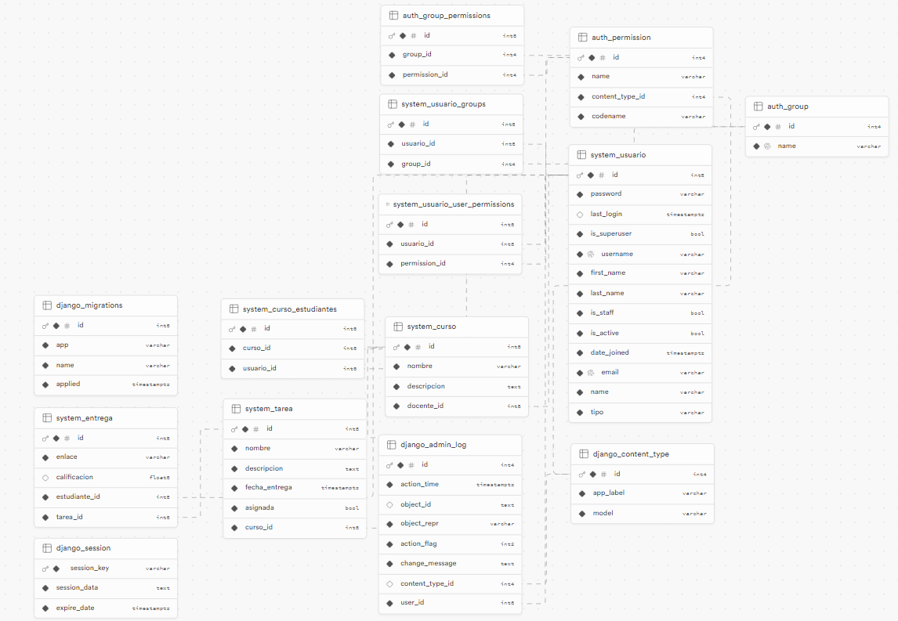

# CoderDojo
CoderDojo es una plataforma educativa en línea desarrollada para modernizar la gestión de cursos, tareas y usuarios en entornos educativos dedicados a la programación. Este sistema educativo busca hacer el aprendizaje de la programación más accesible y motivador, proporcionando una estructura que incluye cursos, tareas y un sistema de calificaciones para fomentar la motivación y la disciplina en los estudiantes.

## Sistema de Gestión Académica
Existen tres tipos de usuarios: Administrador, Profesor y Estudiante. A continuación se detallan las funcionalidades específicas para cada uno:

### Administrador
Como administrador, puedes gestionar toda la plataforma. Tus funciones incluyen:
- **Agregar Cursos**: Puedes crear nuevos cursos.
- **Ver Lista de Cursos**: Accede a una lista de todos los cursos disponibles. Desde aquí, puedes editar o eliminar cualquier curso.
- **Crear Grupos**: Al crear un grupo, se te redirige a un formulario donde debes ingresar el título, descripción e instructor (Profesor).
- **Gestionar Usuarios**: Puedes ver, crear, editar o eliminar tanto estudiantes como profesores. Al eliminar a un usuario, éste deberá registrarse nuevamente para acceder a la plataforma.

### Profesor
Como profesor, tienes la capacidad de gestionar tus grupos y asignar tareas. Tus funciones incluyen:

- **Crear Tareas**: Puedes crear tareas y asignarlas a los grupos que diriges.
- **Asignar Tareas**: Dentro de cada grupo, puedes crear una tarea con título, descripción y la opción de subir archivos. Luego, puedes asignar estas tareas a los grupos correspondientes.

### Estudiante
Como estudiante, puedes interactuar con los cursos y las tareas asignadas. Tus funciones incluyen:

- **Ver Cursos Disponibles**: Puedes ver y unirte a diferentes cursos.
- **Unirse a Cursos**: Al unirte a un curso, serás redirigido a la página del curso donde podrás ver las tareas pendientes.
- **Completar Tareas**: Completa tus tareas ingresando un enlace. El profesor puede responderte con un mensaje que confirme la tarea como completada o con un mensaje personalizado.

## Interfaz del Sistema

### Página de Inicio
 **Bienvenida**: La página de inicio muestra un mensaje de bienvenida a "Coder Dojo".
- **Más Información**: Incluye una sección de más información accesible mediante un scroll que te lleva a una parte inferior con actividades y eventos (esta sección es solo estética).

### Registro y Login
- **Registro**: Si decides registrarte, se te redirigirá a un formulario donde debes ingresar tu nombre, correo y rol (profesor o estudiante).
- **Inicio de Sesión**: Si ya tienes una cuenta, podrás iniciar sesión eligiendo tu rol (estudiante o profesor), ingresando tu correo y contraseña, y haciendo clic en el botón de iniciar sesión.
- **Gestión de Admin**: La gestión del administrador se maneja de forma separada y no está disponible en el formulario de registro.

### Tecnologías Utilizadas

- **Backend**: Django y Django Rest Framework
- **Frontend**: React
- **Base de Datos**: Supabase (PostgreSQL)
- **Autenticación**: JWT
- **Despliegue**: Vercel

## Licencia

Este proyecto está licenciado bajo la Licencia de Yo.

## Requisitos
- Python 3.12
- Django 5.0.6
- Django Rest Framework 3.12.4
- Django Cors Headers 3.7.0
- Node.js 14.17.0
- React 17.0.2
- PostgreSQL 13.3

## Instalación y Configuración
1. Clonar el repositorio:
```bash
git clone https://github.com/Alsnj20/Coder_Dojo.git
```
2. Instalar las dependencias del backend:
```bash
cd backend/
pip install -r requirements.txt
```
3. Instalar las dependencias del frontend:
```bash
cd ../frontend/
npm install
```
4. Ejecutar el servidor backend:
```bash
cd ../backend/
python manage.py runserver
```
5. Ejecutar el servidor frontend:
```bash
cd ../frontend/
npm run dev
```
## Modelado de la Base de Datos
El modelo de la base de datos se compone de las siguientes tabla:


## Deploy
El proyecto se encuentra desplegado en Vercel. Puedes acceder a la plataforma en el siguiente enlace: [Coder Dojo](https://coder-dojo-seven.vercel.app/)
